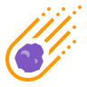

	
	<h1><strong>Asteroids NeoWs - Vue ☄️</strong></h1>

> NeoWs (Near Earth Object Web Service) is a RESTful web service for near earth Asteroid information. With NeoWs a user can: search for Asteroids based on their closest approach date to Earth, lookup a specific Asteroid with its NASA JPL small body id, as well as browse the overall data-set. [NASA Open APIs](https://api.nasa.gov/)